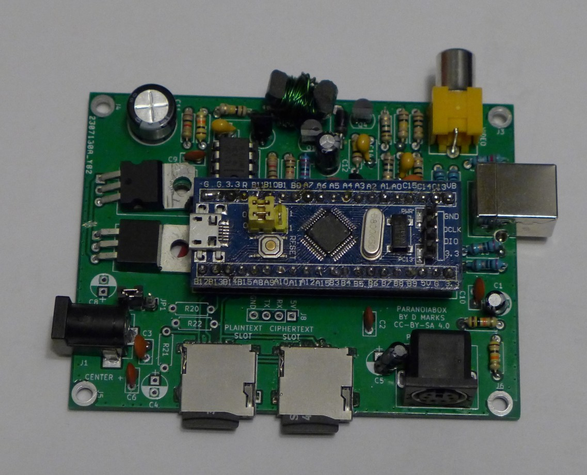
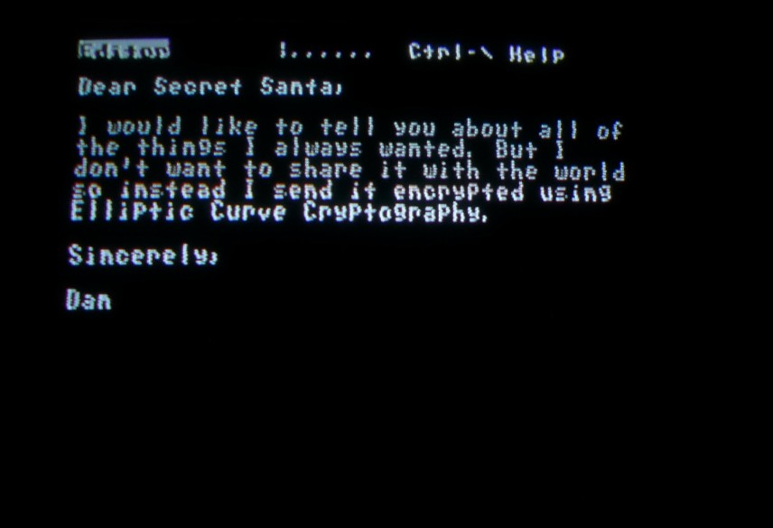
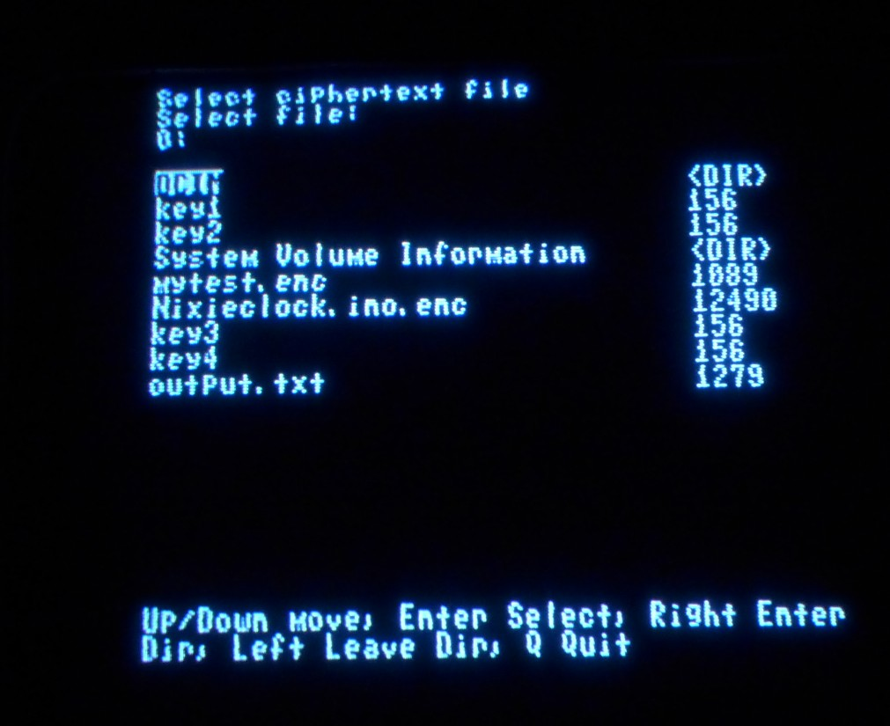
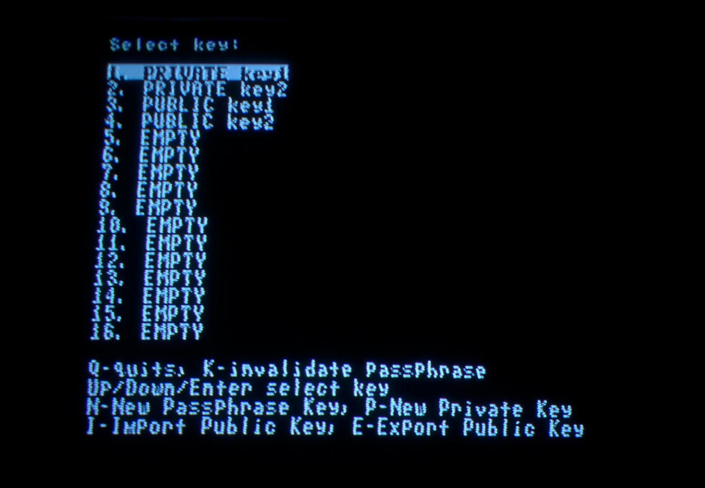
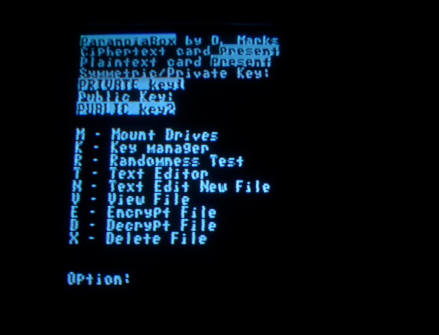
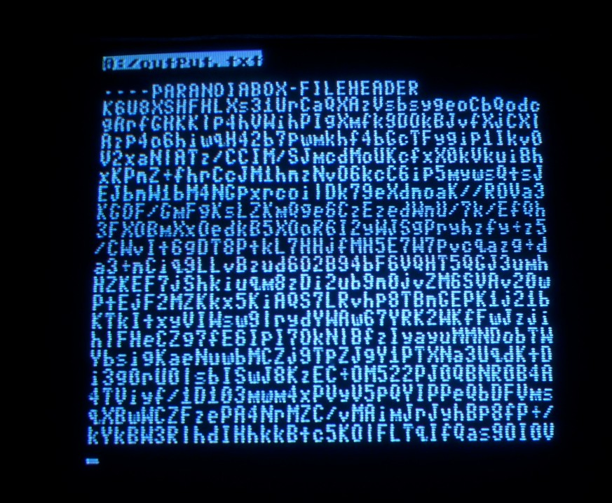
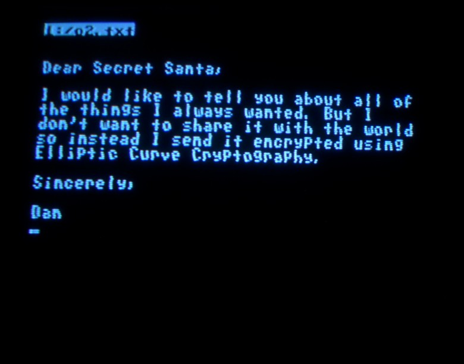

# ParanoiaBox
The ParanoiaBox by Daniel L. Marks

The ParanoiaBox is a standalone open hardware/software encryption device based on the STM32F103CBT6 processor.  On this device, messages may be composed, encrypted, decrypted, and viewed.  The device is an experiment in encryption minimalism, presenting a minimal attack surface by using a small microcontroller rather than a full personal computer with a complex operating system, while providing the functionality needed to transact encrypted messages between humans through insecure networks.  The device is connected to a NTSC television and a PS/2 keyboard for user input and control.  There are two micro SD card slots, one for ciphertext and the other for plaintext used to transact files.  There is a hardware random number generator based on avalanche noise generated in two transistors.  A picture of the complete PCB of the device can be seen below:

At the top of the board is a RCA composite video connector.  At the right is a USB B connector that can be used to program the microcontroller.  At the lower right is a female PS/2 keyboard connector.  At the bottom are two SD card slots.  Finally, at the left is a barrel jack for 7 to 12 volt DC input power.  Except for the micro SD card slots, the PCB is all through assembly so it can be assembled more easily using simple tools.

The hardware is licensed under the Creative Commons CC-BY-SA 4.0 license.  The software written by D. L. Marks is licensed under the zlib license.  All other libraries are licensed under the licenses as described in the corresponding source files.  This hardware and software is provided under these licenses to be used at your own risk.  

THE HARDWARE AND SOFTWARE IS PROVIDED "AS IS", WITHOUT WARRANTY OF ANY KIND, EXPRESS OR IMPLIED, INCLUDING BUT NOT LIMITED TO THE WARRANTIES OF MERCHANTABILITY, FITNESS FOR A PARTICULAR PURPOSE AND NONINFRINGEMENT. IN NO EVENT SHALL THE AUTHORS OR COPYRIGHT HOLDERS BE LIABLE FOR ANY CLAIM, DAMAGES OR OTHER LIABILITY, WHETHER IN AN ACTION OF CONTRACT, TORT OR OTHERWISE, ARISING FROM, OUT OF OR IN CONNECTION WITH THE HARDWARE AND SOFTWARE OR THE USE OR OTHER DEALINGS IN THE HARDWARE AND SOFTWARE.

The project uses Advanced Encryption Standard AES256-GCM Galois Counter Mode as an authenticated symmetric encryption.  The keys are derived from shared secrets based on then Elliptic Curve Diffie-Hellmann (ECDH) 25519.  The keys are encrypted using a passphrase and AES256-GCM and stored in the flash memory of the microcontroller.  The encrypted data and public key certificates are base64 encoded so that they can be transmitted through e-mail as text files.  The library used is the Arduino Cryptography Library by Rhys Weatherley:

https://rweather.github.io/arduinolibs/crypto.html

The project uses the stm32duino libraries located here:

https://github.com/rogerclarkmelbourne/Arduino_STM32

All other Arduino libraries are provided in the libraries directory in this project, including those that provide the FAT fs, NTSC video output, PS/2 keyboard input, and cryptography.  To enter a message into the microcontroller, there is a full-screen text editor:

There is a the built-in full-screen editor used to compose short messages.  Files may be selected from the SD cards for editing, encryption, or decryption:

This is the key manager screen from which the AES 256 symmetric, ECDH25519 private or public keys are selected:

To encrypt/decrypt using AES, a AES key is selected.  To encrypt/decrypt using ECDH25519, a private and public key pair are selected.   Then one selects a file to encrypt or decrypt.  Separate SD cards must be used for encryption and decryption to ensure that both are not available together to be compared.  One can export a public key certificate from a private key.  After selection, the main screen shows the selected keys:

The message is then encrypted by selecting the file from the card in the plaintext slot using the (E)ncrypt option.  Then the encrypted file is placed on the card in the ciphertext slot.  You can view this file which is text encoded to be easily transmitted over email:

Once it has been received, it can be decrypted and viewed, and it looks like the original:

